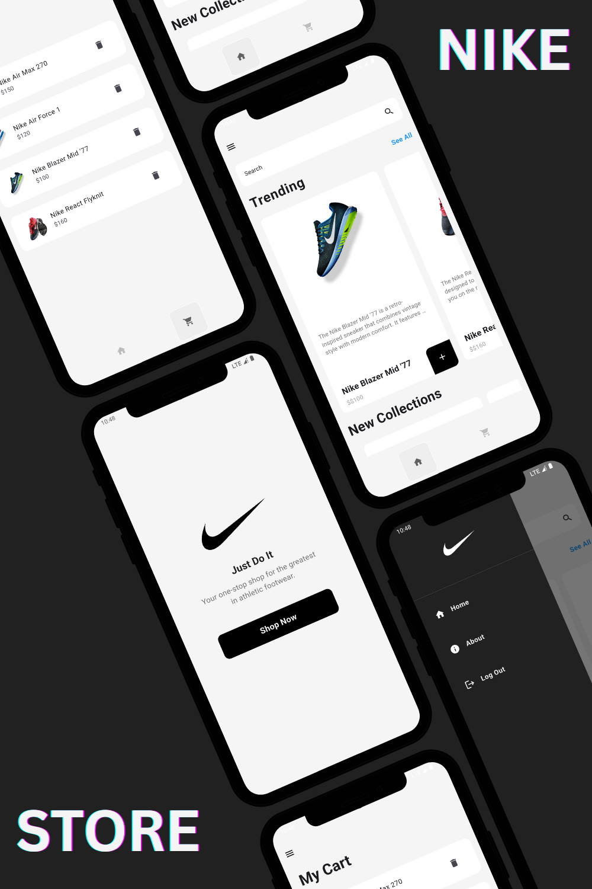

# Nike Store (Flutter)  

An e-commerce app built with **Flutter** for selling shoes (e.g. Nike).  
Includes product listings, cart functionality, and more.

---

## 📸 Screenshot

<p align="center">
  
</p>

---

## 🧩 Features

| Feature | Status / Notes |
|---|---|
| Product listing / shop page | ✔️ (show available shoes) |
| Cart / checkout UI | Partial — add/remove items, view cart |
| Responsive layouts | ✅ Works on mobile / different screen sizes |
| Models & components modularized | ✅ Models, components directories exist |
| Asset management | Includes images in `assets/` |
| State management / logic | TBD / your implementation |

---

## 📁 Project Structure

```

├── android/
├── ios/
├── lib/
│   ├── components/      ← Reusable UI widgets (e.g. `cart_item.dart`, `shoe_tile.dart`)
│   ├── models/          ← Data models (shoe, cart item, etc.)
│   ├── pages/           ← Pages / screens: home_page.dart, shop_page.dart, cart_page.dart, etc.
│   └── main.dart        ← App entry point
├── assets/
│   └── logos/
│       └── nike.png
│   └── images/
│       └── product.png     ← Add your product images here
├── pubspec.yaml
├── pubspec.lock
├── devtools_options.yaml
├── analysis_options.yaml
├── .gitignore
└── README.md

````

- **`lib/components`**: UI components used across multiple pages  
- **`lib/models`**: Data structures  
- **`lib/pages`**: Pages / routes  
- **`assets`**: Images, logos, screenshots  
- **`pubspec.yaml` / `pubspec.lock`**: Flutter dependencies  

---

## ⚙️ Setup & Installation

1. Clone the repo  
   ```bash
   git clone https://github.com/codewith-rafi/nike-store.git
   cd nike-store

2. Install dependencies

   ```bash
   flutter pub get
   ```

3. Run on device / emulator

   ```bash
   flutter run
   ```

4. For code analysis / linting

   ```bash
   flutter analyze
   ```

---

## 🎯 Roadmap / TODOs

* [ ] Implement product detail page
* [ ] Persist cart data (local storage or backend)
* [ ] Integrate backend / API for product data
* [ ] User authentication / login
* [ ] Order checkout flow
* [ ] Improve error handling & UI feedback
* [ ] Unit & integration tests

---

## 📄 License & Attribution
This project is licensed under the MIT License.
Feel free to use, modify, and distribute with proper attribution.
